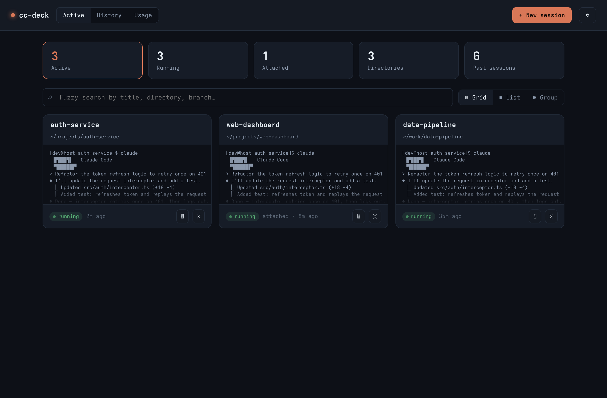
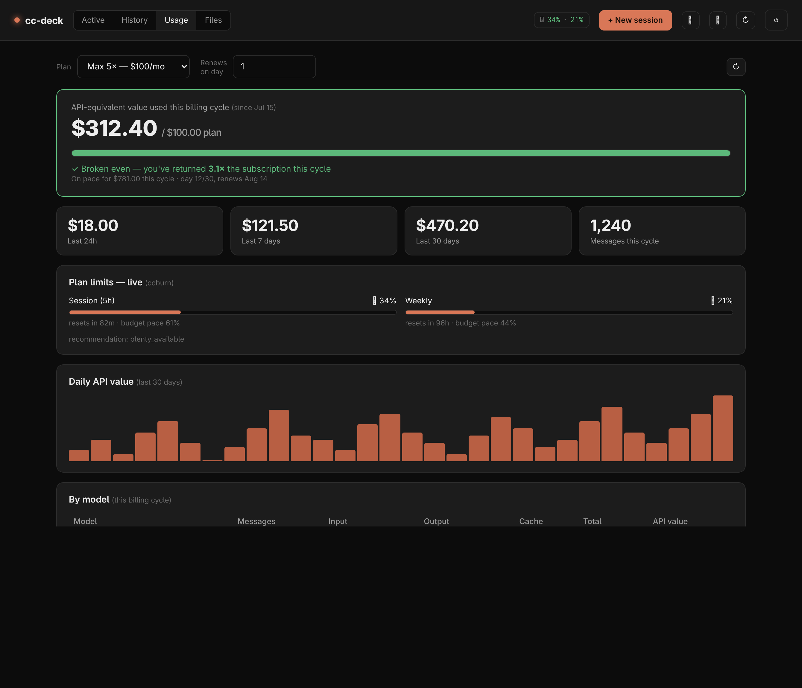
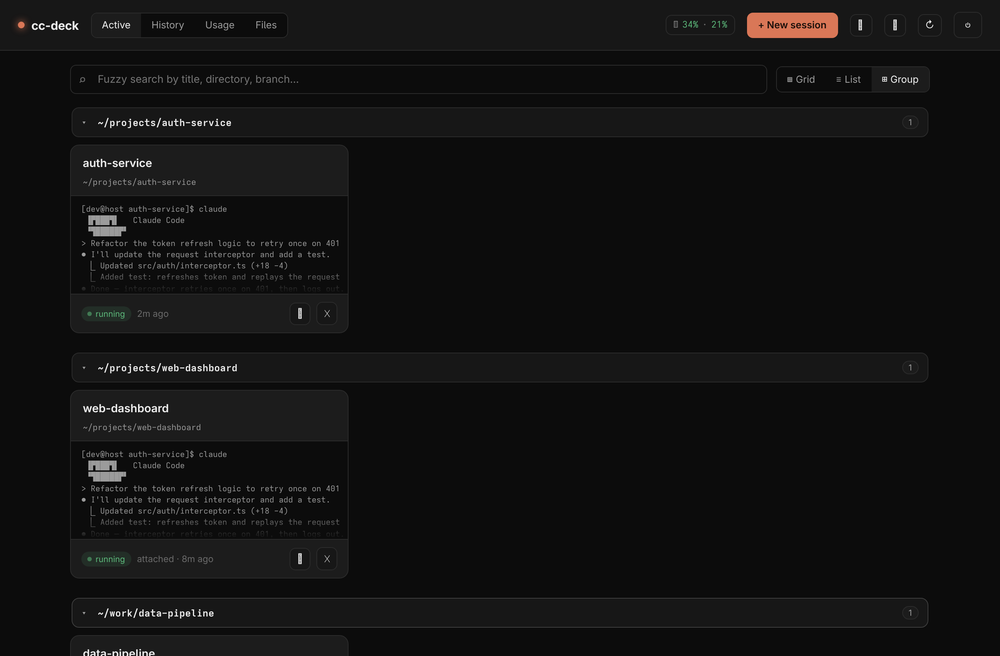
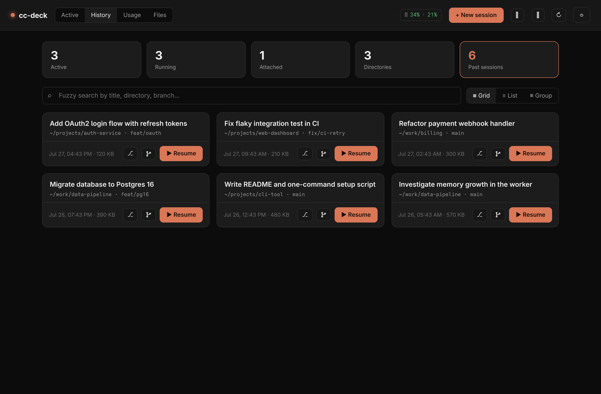

# cc-deck

A self-hosted web dashboard for your **Claude CLI** sessions. See every running session
in a grid/list/grouped view, launch a new `claude` in any directory, resume or fork past
conversations, and click into a fast, smooth in-browser terminal — the real CLI, no wrapper.
Sessions can hand context to each other through notes, and cc-deck exposes an **MCP endpoint**
so Claude.ai, Claude Code, or your own agents can search past work and drive sessions remotely.

Each session is a **tmux** session running `claude`, so sessions persist through tab-closes,
no connected client, and restarts of the cc-deck app/tunnel. cc-deck runs them on its **own
dedicated tmux server** (`tmux -L ccdeck`, kept alive with `exit-empty off`) — isolated from
your personal `tmux`, and immune to the "server exits when the last session closes" trap.
Attach from a shell with `tmux -L ccdeck attach`. It also **snapshots active sessions and
restores them after a host reboot** (see [Reboot survival](#reboot-survival)).

```
browser (xterm.js)  ──ws──▶  Node/Fastify  ──node-pty──▶  tmux attach -t ccdeck-…  ──▶  claude
        ▲                          │  launch · resume · fork · kill · rename (REST)
        │                          │  notes · handoff · usage/ROI · files · snapshot
 Claude.ai / Claude Code  ──MCP──▶ │  search sessions · read context · create · send
        └──── grid / list / group / search ────┘
```

## Screenshots

| Active sessions | Usage & ROI |
|---|---|
|  |  |

| Grouped by directory | History (resume) |
|---|---|
|  |  |

<sub>Regenerate with `node scripts/screenshots.mjs` (needs `npm install playwright --no-save && npx playwright install chromium`, plus a `TOKEN` env var set to a valid `ccdeck` cookie value — the header of the script shows how to mint one).</sub>

## Features

### Sessions & terminal
- **Launch anywhere under your roots** — a folder picker (create-folder inline) starts a new
  `claude` in any directory under `CCDECK_ROOTS`. Give it a title and an optional seed prompt.
- **Resume & fork** — "▶ Resume" runs `claude --resume <id>` in the original directory as a
  fresh live session; **fork** (`--fork-session`) branches into a new independent session that
  copies the prior history and leaves the original untouched.
- **Real in-browser terminal** — a full-screen xterm.js terminal (WebGL/canvas renderer,
  auto-reconnect). Closing the browser only *detaches* — Claude keeps running. A per-terminal
  **scroll-mode toggle** switches between *tmux* (native copy-mode, full history) and *fast*
  (strips the alt-screen so the wheel scrolls xterm's local buffer instantly). Per-device
  window-size ownership means a desktop and a phone attached at once don't fight over the size.
- **In-terminal session switcher** — a collapsible sidebar (off-canvas drawer on mobile) lists
  every active session with live/idle and "needs-attention" dots (unseen activity since you last
  looked). Click to switch in place, **Alt+` / Alt+Shift+`** to cycle most-recently-used
  (Zen-style overlay), or **Alt+1–9** to jump directly. The current + 2 most-recent sessions are
  kept **warm** (attached in the background), so switching between them is instant.

### Organize & find
- **Status panel** — at-a-glance counts (active, running, attached, distinct directories, total
  past sessions); the tiles double as tab switches.
- **Fuzzy search** — instant subsequence search across title, directory, and git branch, ranked
  by relevance, in both Active and History tabs.
- **Three views** — grid (with live pane previews), compact list, or **grouped by directory**
  (collapsible; starts collapsed so you can scan many directories fast).
- **History tab** — past Claude sessions from `~/.claude/projects` with directory, branch, time,
  and opening prompt (hides currently-running ones and any dir in `CCDECK_EXCLUDE_DIRS`).
- **Session graph** — a git-log-style branch/thread viewer for a transcript, so forked and
  resumed lineages are readable.
- **Files & uploads** — browse/download/delete files under your roots, and drag-drop files or
  whole folders straight into a session's working directory.
- **Remote sessions (over SSH)** — list and attach **tmux sessions on other tailnet hosts**
  (a laptop, another box) right in the terminal sidebar, tagged by host. Attach-only for now
  (no rename/kill/notes). See [Remote sessions](#remote-sessions-on-other-hosts).

### Usage & cost
- **Usage tab — ROI on your plan** — pick your plan (Pro / Max 5× / Max 20× / custom) and
  billing-renewal day, then see the API-equivalent dollar value of your usage this billing cycle
  vs the subscription price ("are you breaking even?"), a daily-spend chart, and a per-model
  breakdown. Token prices are pulled **live** from the
  [LiteLLM pricing dataset](https://github.com/BerriAI/litellm) (disk-cached, ~7-day refresh,
  with a built-in fallback) so the numbers don't go stale. Covers all local Claude Code CLI
  usage on the machine (cc-deck + direct + headless), not claude.ai web/mobile.
- **Burn pill** — if [`ccburn`](https://github.com/JuanjoFuchs/ccburn) is installed, a top-bar
  pill shows live session (5h) and weekly plan-limit utilization with pace indicators, plus a
  popover breakdown.

### Handoff, notes & context
- **External notes** — other agents (via MCP) can `save_session_summary` to leave a note on a
  session; cc-deck badges it, and on the next open/resume it's **seeded into the session** as
  context. Notes follow a session across resume/fork (lineage-matched), and are consumed once
  delivered. There's also an "apply to running" action to inject them immediately.
- **Context handoff** — build a markdown handoff from one *or several* prior sessions (an AI
  summary via headless `claude -p`, or the full transcript) and seed it into a **new** session
  or inject it into a **running** one.

### Remote control (MCP) — see [MCP and remote connectors](#mcp-and-remote-connectors)
- **MCP endpoint** — a Streamable-HTTP MCP server at `/mcp` lets Claude.ai connectors, Claude
  Code, or your own agents **search past sessions, read a session's context, leave handoff
  notes, and (with the right token) create and drive sessions**.
- **Handoff-aware sessions** — optionally auto-wire every new session with the read-only MCP + a
  short system-prompt nudge, so a session can discover related work elsewhere and hand off
  instead of duplicating (`CCDECK_SESSION_MCP=on`).
- **Browser access** — opt a session into driving a logged-in Chrome (via `chrome-devtools-mcp`
  over CDP) straight from the New Session dialog.

### Reliability & access
- <a id="reboot-survival"></a>**Reboot survival** — cc-deck snapshots active sessions
  (periodically, on graceful stop, and via `npm run snapshot`) to `restore.json`, and on a fresh
  boot with no sessions already running it relaunches them with `claude --resume` (falling back
  to a fresh session if the transcript is gone). Disable with `CCDECK_RESTORE=off`.
- **Storage / retention hub** — inventory and selectively delete cc-deck artifacts (handoffs,
  caches) and old transcripts; transcripts of running sessions are protected.
- **Installable PWA** — a service worker precaches the app shell for offline load and prompts to
  reload when a new build ships; add-to-home-screen on mobile.
- **Auth** — password login with a signed cookie. Binds to loopback; exposed via Tailscale or
  Cloudflare. Safe to put on a public hostname (layer Cloudflare Access for per-identity control).
- **Mobile-friendly** — responsive layout, iOS safe-area + dynamic-viewport handling, and an
  on-screen key bar (Esc / Tab / Ctrl / arrows) in the terminal since phone keyboards lack them.

## Requirements

- **Node.js ≥ 18**, **tmux**, and the **Claude CLI** (`claude`) on `PATH`.
- A C toolchain (`gcc`/`clang`, `make`, `python3`) is needed once to build `node-pty`.
- Linux or macOS. The optional background service uses systemd (Linux).
- *Optional:* [`ccburn`](https://github.com/JuanjoFuchs/ccburn) (`npm i -g ccburn`) for the live
  plan-limit burn pill/charts. The Usage tab's ROI/cost numbers work without it.

## Quick start

```bash
git clone <your-fork-url> cc-deck && cd cc-deck
./setup.sh            # checks deps, installs, builds, creates .env, optional service
npm start             # if you didn't install the service — listens on 127.0.0.1:8787
```

`setup.sh` is interactive and idempotent: it installs dependencies, builds the frontend,
generates a `.env` (random cookie secret + a password you choose), and optionally installs a
systemd **user** service. Re-running it won't clobber an existing `.env`.

Manual setup instead of the script:

```bash
npm install && npm run build
cp .env.example .env      # then set CCDECK_PASSWORD and a random CCDECK_SECRET:
node -e "console.log(require('crypto').randomBytes(32).toString('hex'))"
npm start
```

Rebuild the frontend after editing anything in `src/client/` with `npm run build`
(or `npm run dev` for watch mode + server auto-restart).

## Configuration (`.env`)

Only the first two are required; everything else has a sensible default. See `.env.example`
for the full annotated list.

| Var | Default | Meaning |
|-----|---------|---------|
| `CCDECK_PASSWORD` | — | Login password (**required**). |
| `CCDECK_SECRET` | insecure default | Random string used to sign cookies + OAuth tokens. Set this. |
| `PORT` | `8787` | Listen port. |
| `CCDECK_BIND` | `127.0.0.1` | Bind address — keep loopback so the raw port isn't exposed. |
| `CCDECK_ROOTS` | `$HOME` | Colon-separated dirs sessions may launch/browse under. |
| `CCDECK_EXCLUDE_DIRS` | — | Colon-separated dirs to hide from the History tab (e.g. where another app runs `claude -p` headlessly). |
| `CCDECK_LAUNCH` | `claude` | Command run in each new session. |
| `CCDECK_PERMISSION_MODE` | — | Permission mode new sessions start in (`acceptEdits`/`auto`/`plan`/…). Empty = Claude's default. |
| `CCDECK_REMOTE_HOSTS` | — | Hosts whose tmux sessions to list+attach over SSH (see [Remote sessions](#remote-sessions-on-other-hosts)). |
| `CCDECK_TMUX_SOCKET` | `ccdeck` | Dedicated tmux `-L` socket name. |
| `CCDECK_MCP_TOKEN` | — | Static bearer for the MCP endpoint. Empty = the bearer path is off. Enables the session-control tools (`create_session`/`send_to_session`). |
| `CCDECK_MCP_TOKEN_READONLY` | — | Read-only MCP bearer (search + leave-note only). Used to auto-wire sessions. |
| `CCDECK_SESSION_MCP` | off | `on` auto-wires every new session with the read-only MCP + a handoff nudge. |
| `CCDECK_PUBLIC_URL` | derived | Public origin for OAuth metadata (e.g. `https://claude.example.com`). Auto-derived from request headers if unset. |
| `CCDECK_RESTORE` | on | `off` disables snapshot/restore across reboot. |
| `CCDECK_RESTORE_FILE` | `~/.claude/cc-deck/restore.json` | Snapshot location. |
| `CCDECK_PRICING_URL` | LiteLLM dataset | Token-pricing source for the Usage tab. |
| `CCDECK_PRICING_TTL_HOURS` | `168` | How often to refetch pricing (default 7 days). |
| `CCDECK_CACHE_DIR` | `~/.cache/cc-deck` | Where pricing + retention caches live. |

## MCP and remote connectors

cc-deck speaks **MCP** (Model Context Protocol) over Streamable HTTP at `POST /mcp`, so remote
clients can work with your sessions. Three auth paths, three privilege levels:

| Caller | How it authenticates | What it can do |
|---|---|---|
| **Claude.ai / desktop connector** | OAuth 2.1 (dynamic client registration + PKCE; you approve on a consent page using the cc-deck password) | Read tools + leave notes |
| **Read-only bearer** (`CCDECK_MCP_TOKEN_READONLY`) | `Authorization: Bearer …` | Read tools + leave notes |
| **Static bearer** (`CCDECK_MCP_TOKEN`) | `Authorization: Bearer …` | Everything, including create/drive sessions |

**Tools**

- `search_sessions` — keyword-search past transcripts; returns matching snippets (secrets redacted).
- `list_recent_sessions` — most-recent sessions with title/dir/date.
- `list_sessions` — currently **active** sessions with live, structured status (`running` / `waiting_input` / `idle` / `done`, plus `needs_input`, `last_activity`) — poll and diff to detect transitions (a session finishing, waiting on you, or exiting).
- `get_session_context` — read a session as an AI `summary` or a truncated `transcript`.
- `save_session_summary` — leave a handoff note on a session's lineage (surfaces on next open/resume).
- `create_session` — launch a new session in a directory (auto-creates it under a root). **Static bearer only.**
- `send_to_session` — type a line into a running session. **Static bearer only.**

**Connect from Claude.ai** — add a custom connector pointing at
`https://<your-cc-deck-host>/mcp`; you'll be sent through the OAuth consent page (log in with the
cc-deck password) and the connector gets the read + note tools. Set `CCDECK_PUBLIC_URL` if the
host can't be derived from request headers.

**Connect from Claude Code / your own agent** — point an MCP client at `/mcp` with a bearer token.
Use the static token if the agent should be able to create and drive sessions; use the read-only
token if it should only search and leave notes.

**Handoff-aware sessions** (`CCDECK_SESSION_MCP=on`) — every new session is launched with the
read-only MCP pre-wired (loopback URL, read-only bearer) plus a one-line system-prompt nudge, so
sessions can discover related work and hand off through notes instead of duplicating it. They
**cannot** start or drive other sessions — that stays operator-only via the static bearer.

**Browser access** — the New Session dialog has a *Browser access* dropdown. Choosing it launches
the session with an extra `--mcp-config ~/.claude/cc-deck/browser-mcp.json`, which attaches
[`chrome-devtools-mcp`](https://github.com/ChromeDevTools/chrome-devtools-mcp) to a Chrome you're
already logged into (over CDP), so the session can drive that browser. Create that config file
yourself, e.g.:

```json
{ "mcpServers": { "chrome": { "command": "npx",
  "args": ["chrome-devtools-mcp@latest", "--browser-url", "http://127.0.0.1:9222"] } } }
```

(Launch Chrome with `--remote-debugging-port=9222`. Only one client should *drive* the browser at
a time.) The option is inert if the file doesn't exist.

## Remote sessions on other hosts

cc-deck can also list and attach **tmux sessions running on other machines** (a laptop that
stayed on, another box) — reached over SSH, ideally across your tailnet. They appear in the
terminal sidebar tagged by host, and clicking one attaches through the browser like a local
session. It's **attach-only** for now (no rename/kill/notes).

```bash
# in .env — comma/space-separated; "sshTarget" or "label=sshTarget"
CCDECK_REMOTE_HOSTS=laptop=cyber@laptop.tailnet.ts.net dell-box
```

Two prerequisites, because a session is only remotely attachable if its terminal is shareable:

1. **Key-based SSH** from the cc-deck host to each remote host (cc-deck uses `BatchMode=yes`, so
   it never hangs on a password/host-key prompt — set up keys first).
2. **The remote session must run inside tmux.** A bare `claude` in a plain terminal has a PTY
   owned by that terminal — nothing else can attach to it. So start remote work like:

   ```bash
   tmux new -s work claude       # then it shows up in cc-deck as "work" on that host
   ```

cc-deck lists the remote's tmux sessions with `ssh <host> tmux list-sessions` and attaches with
`ssh -t <host> tmux attach`; resize propagates over SSH. Empty by default — set
`CCDECK_REMOTE_HOSTS` to enable.

## Serve it on your tailnet (TLS, no open ports)

[`tailscale serve`](https://tailscale.com/kb/1242/tailscale-serve) terminates HTTPS with an
automatic cert and proxies to the local app:

```bash
tailscale serve --bg --https=443 http://127.0.0.1:8787
tailscale serve status      # prints the https://<machine>.<tailnet>.ts.net URL
```

Reachable from any device on your tailnet. (If it says "Access denied", run
`sudo tailscale set --operator=$USER` once.) Stop with `tailscale serve --https=443 off`.

## Keep it running (systemd user service)

`setup.sh` can do this for you. Manually:

```bash
# the unit in systemd/ uses placeholders; fill them for your machine:
mkdir -p ~/.config/systemd/user
sed -e "s|__CCDECK_DIR__|$PWD|g" -e "s|__NODE__|$(command -v node)|g" \
    -e "s|__PATH__|$(dirname $(command -v node)):/usr/local/bin:/usr/bin:/bin|g" \
    systemd/cc-deck.service > ~/.config/systemd/user/cc-deck.service
systemctl --user daemon-reload && systemctl --user enable --now cc-deck
sudo loginctl enable-linger "$USER"     # keep running while logged out
journalctl --user -u cc-deck -f         # logs
```

The unit sets **`KillMode=process`** on purpose: cc-deck's dedicated tmux server runs in the
service's cgroup, so the default `control-group` kill would destroy every session on each restart.
`KillMode=process` stops only the node process and leaves tmux (and your sessions) running across
restarts.

**Remember:** changes to `.env` need `systemctl --user restart cc-deck`; changes to `src/client/*`
need `npm run build` first. With `KillMode=process`, restarts no longer disturb running sessions.

## Exposing on your own domain via Cloudflare (access off-VPN)

A named Cloudflare Tunnel reaches the loopback app with no inbound ports, and Cloudflare Access
gates it at the edge so it's never publicly exposed:

```bash
# 1. install cloudflared, then authenticate + pick your domain (opens a browser)
cloudflared tunnel login
# 2. create the tunnel and route a hostname to it
cloudflared tunnel create cc-deck
cloudflared tunnel route dns cc-deck claude.example.com
# 3. config pointing at the local app (use a dedicated file if you have other tunnels)
cat > ~/.cloudflared/cc-deck.config.yml <<YAML
tunnel: <TUNNEL_ID>
credentials-file: $HOME/.cloudflared/<TUNNEL_ID>.json
ingress:
  - hostname: claude.example.com
    service: http://127.0.0.1:8787
  - service: http_status:404
YAML
# 4. run it (a systemd user service like cc-deck's keeps it up; enable-linger to persist)
cloudflared tunnel --config ~/.cloudflared/cc-deck.config.yml run
```

Then, in **Zero Trust → Access → Applications**, add a **self-hosted** app for
`claude.example.com` with an **Allow** policy limited to your email (the built-in **One-time PIN**
method emails you a code — no IdP setup needed). Now reaching the hostname requires a Cloudflare
login *before* the app is touched, and the app password is a second layer. cc-deck sets `secure`
cookies when it sees `x-forwarded-proto: https`, and WebSockets (the terminal) pass through Access
using the browser's Access cookie, so it all works behind the tunnel. Keep your Tailscale route as
well — on-VPN access is unaffected.

> **Note for the MCP connector:** a Claude.ai remote connector can't complete the OAuth handshake
> through an interactive Access login. Either scope an Access **service token** / bypass for the
> `/mcp` and `/.well-known/*` + `/oauth/*` paths, or reach `/mcp` over the tailnet with a bearer
> token instead.

## Security notes

- All tmux/pty calls use `execFile`/`spawn` with argument arrays — no shell, no injection.
- Session names are validated (`^ccdeck-[A-Za-z0-9]+$`), resume IDs must be UUIDs, and launch/
  upload directories must resolve under `CCDECK_ROOTS`.
- The MCP `search_sessions` output redacts `sk-ant-…` keys before returning transcript snippets.
- Single shared password (no multi-user accounts) — layer Cloudflare Access for per-identity control.
- Keep `CCDECK_BIND=127.0.0.1` so the unauthenticated raw port is never on the network. Treat
  `CCDECK_MCP_TOKEN` like a password — it can create and drive sessions.

## Project layout

```
src/server.js      Fastify app: static, REST API, auth gate, ws + /mcp routes
src/auth.js        password check + HMAC-signed cookie / token
src/oauth.js       single-user OAuth 2.1 AS for MCP connectors (DCR + PKCE, in-memory)
src/mcp.js         MCP server + tools (search / context / notes / create / send)
src/tmux.js        list/create/kill/rename/preview — wraps tmux (resume, fork, MCP auto-wire)
src/pty.js         websocket ⇄ node-pty(`tmux attach`) bridge
src/agents.js      parse live Claude state (title / mode / session id) from a pane
src/history.js     scans ~/.claude/projects for resumable past sessions
src/notes.js       external note store — save, lineage-match, seed on open, consume
src/handoff.js     build a context handoff (AI summary or transcript) → new/running session
src/graph.js       git-log-style branch/thread graph of a transcript
src/usage.js       token usage + API-equivalent cost from transcripts (ROI), mtime-cached
src/pricing.js     live Anthropic token pricing (LiteLLM dataset, disk-cached + fallback)
src/burn.js        shells out to `ccburn --json` for live plan-limit utilization
src/restore.js     snapshot active sessions + restore them after a host reboot
src/remote.js      list + attach tmux sessions on other hosts over SSH (CCDECK_REMOTE_HOSTS)
src/storage.js     retention hub — inventory + selective delete of artifacts/transcripts
src/config.js      env config
src/client/*.js    dashboard + terminal + PWA (bundled by esbuild into public/)
public/*.html      login / dashboard / terminal pages + manifest/icons
systemd/           user-service unit template (filled in by setup.sh)
scripts/           snapshot CLI + screenshot generator
setup.sh           one-command installer
```

## Contributing

Issues and PRs welcome — cc-deck aims to stay small and dependency-light. See
[CONTRIBUTING.md](CONTRIBUTING.md) for dev setup and conventions, and the
[Code of Conduct](CODE_OF_CONDUCT.md). Please report security issues privately per
[SECURITY.md](SECURITY.md), not as a public issue.

## License

[Apache-2.0](LICENSE).
